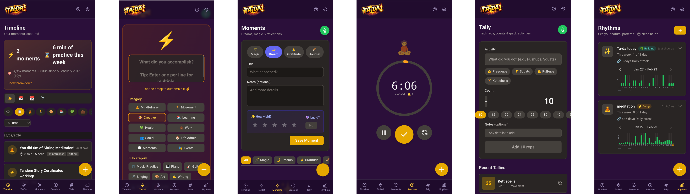
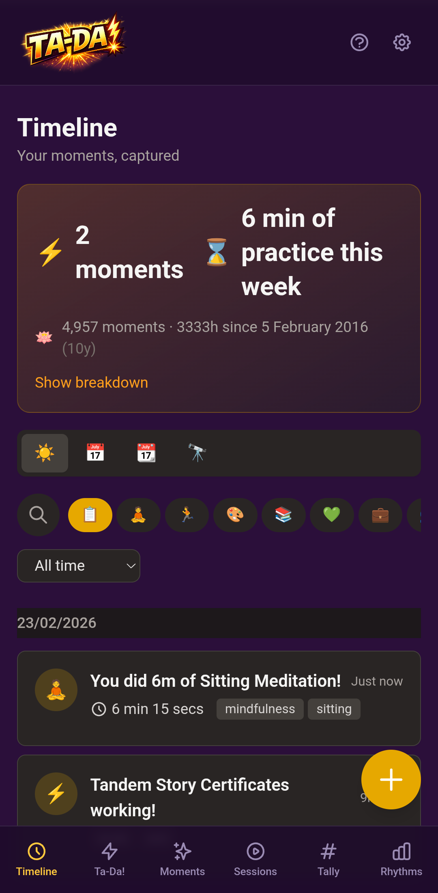
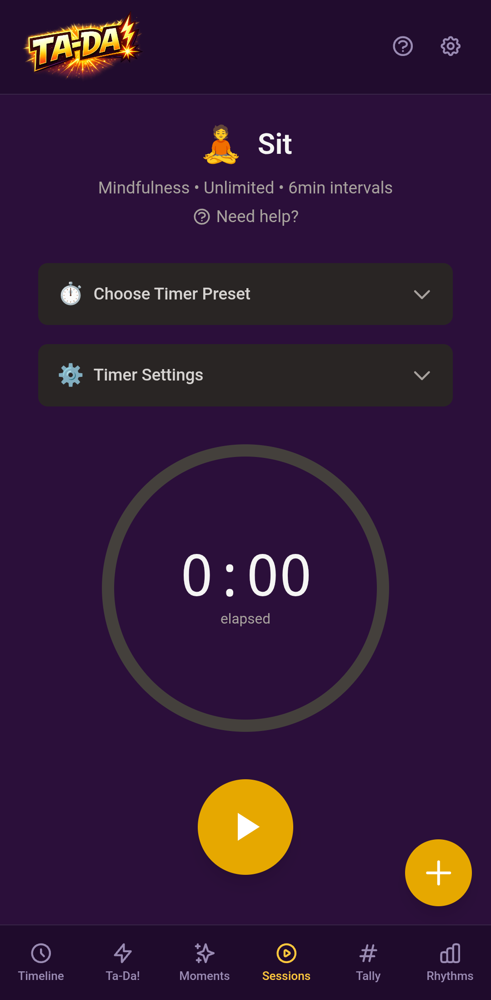
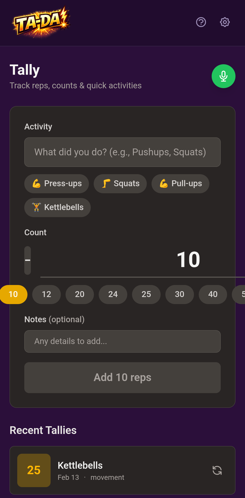
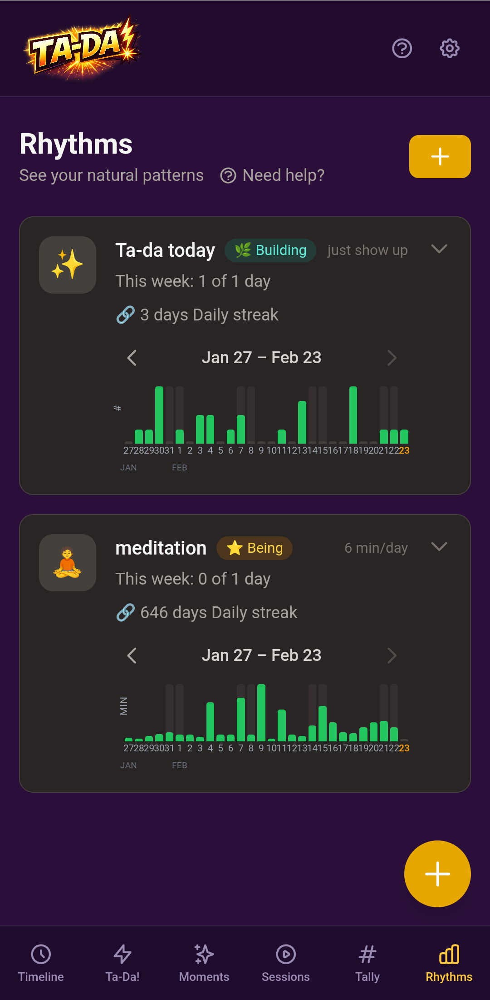

<p align="center">
  
</p>

# ⚡ Ta-da!

**Track Activities, Discover Achievements** — A personal lifelogger for meditation, rhythms, dreams, and accomplishments.

Ta-Da! is an open-source Progressive Web App (PWA) that helps you notice and celebrate your life. Rather than prescribing what you _should_ do, Ta-Da! helps you observe what you actually _did_ — swapping the anxiety-inducing todo list into a celebration of accomplishment.

> _"We don't want to tell people what they should be doing. We want to help them notice what they actually did, and help them feel good about it."_

<p align="center">
  
</p>

## Philosophy

Ta-Da! inverts the traditional productivity mindset:

- **Noticing, not tracking** — Observe your life without judgment
- **Celebration, not obligation** — Turn todos into "Ta-Da!"s
- **Identity over streaks** — You're a meditator, not a streak maintainer
- **Graceful chains** — Missing a day isn't failure
- **Data ownership** — Your life data belongs to you, always exportable

Read more: [design/philosophy.md](design/philosophy.md)

## Modules

Ta-Da! is built around a **modular architecture** — each feature is a self-contained module that registers itself with a central registry. This makes the system extensible: add new entry types, importers, exporters, or sync providers without touching core code.

See [docs/modules/](docs/modules/README.md) for in-depth documentation of each module, or [MODULES.md](MODULES.md) for the developer guide on creating new modules.

---

### [Timeline](docs/modules/timeline.md)



Your life at a glance. The Timeline is the home screen — a chronological view of everything you've noticed, with day/week/month/year zoom levels, infinite scroll, and category filtering.

Search with natural date parsing, see your journey badge celebrating accumulated hours, and watch patterns emerge over time.

**Key features:** Multiple zoom levels, category filtering, journey badges, virtual scroll for performance

<br clear="right"/>

---

### [Ta-Da! Wins](docs/modules/tada.md)


Celebrate accomplishments as they happen. From finishing a painting to calling a friend — every win deserves a moment of recognition.

Capture wins by typing or speaking naturally. Voice input uses AI to extract and structure multiple ta-das from a single sentence. Celebrations include confetti, sound effects, and significance levels (minor, normal, major).

**Module:** `app/modules/entry-types/tada/` · **Type:** `tada`

<br clear="right"/>

---

### [Moments](docs/modules/moments.md)


A space for dreams, ideas, gratitude, and reflections. Moments captures the inner life — the things worth remembering that don't fit neatly into categories.

Rich markdown content with mood tracking (1-5), freeform themes and tags, and voice input that can automatically extract ta-das from your reflections.

**Module:** `app/modules/entry-types/moment/` · **Type:** `moment`

<br clear="right"/>

---

### [Sessions](docs/modules/sessions.md)



A timer for meditation and focused practices. It counts up so that every second of practice is visible — and so you can keep going when you're in the right state. Set yourself six minutes, find your flow, and carry on to ten.

Supports unlimited and fixed duration modes, interval bells, warm-up countdown, customizable presets, and post-session voice reflection. Session recovery ensures you never lose a session if the app closes.

**Module:** `app/modules/entry-types/timed/` · **Type:** `timed`

<br clear="right"/>

---

### [Tally](docs/modules/tally.md)



Quick count tracking for anything discrete — push-ups, glasses of water, pages read, or any activity you want to count rather than time.

Simple tap-to-increment interface with custom units, voice input for batch entries, and full integration with the timeline and rhythms system.

**Module:** `app/modules/entry-types/tally/` · **Type:** `tally`

<br clear="right"/>

---

### [Rhythms](docs/modules/rhythms.md)



Graceful chains that celebrate consistency without punishing breaks. Instead of brittle all-or-nothing streaks, Rhythms tracks natural patterns across five chain types:

- **Daily** — Consecutive days
- **Weekly High** — 5+ days per week
- **Weekly Regular** — 3+ days per week
- **Weekly/Monthly Target** — Cumulative minutes per period

Features year tracker heatmaps, journey stages (Beginning → Building → Becoming → Being), and identity-based encouragement.

**Module:** `app/modules/rhythms/`

<br clear="right"/>

---

## More Features

- **🎤 Voice Input** — Speak naturally; AI extracts and structures entries automatically
- **📥 CSV Import** — Import from Insight Timer and other apps with custom field mapping
- **📤 Multi-Format Export** — JSON, CSV, Markdown, Obsidian (daily/weekly/monthly)
- **🔄 Sync Providers** — Bidirectional sync with Obsidian vaults (extensible to other services)
- **❓ Help System** — Searchable FAQ and contextual help panels
- **📰 Blog** — Philosophy articles on mindful tracking
- **📱 PWA** — Installable, works offline, feels native
- **🔒 Self-Hosted** — Your data stays yours; Docker one-liner deployment

### REST API v1

- **🔌 24 Endpoints** across 7 user stories
- **🔑 API Key Management** with granular permissions
- **🪝 Webhooks** with HMAC-SHA256 signing and auto-retry
- **🔍 Pattern Discovery** — Automated correlation detection with statistical analysis
- **⚡ Rate Limiting** with configurable limits

See [docs/tada-api/API-SPECIFICATION.md](docs/tada-api/API-SPECIFICATION.md) for the complete API reference.

## Architecture

Ta-Da! uses a **unified Entry model** — everything is an entry. No separate tables for meditations, dreams, or wins — just one flexible `entries` table with type, category, and subcategory fields. Rhythms are aggregation queries over entries, not separate data.

**Why?** Simplicity. One data model, one API, infinite flexibility. Add new activity types without schema migrations.

### Module System

The architecture follows a **self-registering module pattern**:

```
app/
  types/           # Interfaces (EntryTypeDefinition, DataImporter, DataExporter, SyncProvider)
  registry/        # Central registries (entry types, importers, exporters, sync providers)
  modules/
    entry-types/   # One directory per type (tada, timed, tally, moment, ...)
    importers/     # CSV generic, Insight Timer, ...
    exporters/     # JSON, CSV, Markdown, Obsidian
    sync-providers/# Obsidian vault sync, ...
  plugins/
    modules.client.ts  # Auto-imports all modules
```

Each module defines its metadata and calls `registerEntryType()` / `registerImporter()` / etc. on import. Zero core code changes needed to add a new module.

See [MODULES.md](MODULES.md) for the developer guide and [design/modularity.md](design/modularity.md) for the design decision.

## Tech Stack

- **Framework:** [Nuxt 3.15.1](https://nuxt.com/) + Vue 3 + TypeScript
- **Database:** SQLite via [Drizzle ORM](https://orm.drizzle.team/)
- **Authentication:** [Lucia Auth v3](https://lucia-auth.com/)
- **PWA:** [@vite-pwa/nuxt](https://vite-pwa-org.netlify.app/frameworks/nuxt.html)
- **Styling:** [Tailwind CSS](https://tailwindcss.com/)
- **Runtime:** [Bun 1.3.5](https://bun.sh/)
- **Container:** Docker with Alpine Linux

**Why these choices?** See [design/decisions.md](design/decisions.md)

## Entry Ontology

A flexible three-level classification system for all life activities:

```
Type (behavior)  →  Category (domain)  →  Subcategory (specific)
    ↓                     ↓                        ↓
  "timed"          "mindfulness"              "sitting"
  "tada"           "accomplishment"              "work"
  "tally"          "movement"                 "push-ups"
  "moment"         "journal"                  "dream"
```

Types define behavior (how it's recorded), categories enable grouping (life domains), subcategories provide specificity. All are open strings — add your own without touching code.

Read more: [design/ontology.md](design/ontology.md)

## Quick Start

### For Users

**Docker (Recommended):**

```bash
docker compose up -d
```

Visit `http://localhost:3000`, create an account, and start logging!

**Data Location:** `/data/db.sqlite` in container (mount as volume for persistence)

### For Developers

```bash
git clone https://github.com/InfantLab/Ta-Da!.git
cd Ta-Da!/app
bun install
bun run dev
```

Development server runs on `http://localhost:3000` with hot reload.

See [docs/DEVELOPER_GUIDE.md](docs/DEVELOPER_GUIDE.md) for complete setup and [docs/PROJECT_STRUCTURE.md](docs/PROJECT_STRUCTURE.md) for architecture overview.

## Development

**Commands:**

```bash
bun run dev          # Start dev server (:3000)
bun run lint:fix     # Auto-fix code style
bun run typecheck    # Type check
bun run db:generate  # Generate migrations
bun run db:migrate   # Apply migrations
bun run db:studio    # Database UI (:4983)
```

**CI/CD:**

- ✅ ESLint + TypeScript checks on every push
- ✅ Automated tests (when written)
- ✅ Docker image build and push to GHCR on merge to `main`

See [docs/DEVELOPER_GUIDE.md](docs/DEVELOPER_GUIDE.md) for full development workflow.

## Roadmap

**Current:** v0.4.0 (Cloud Platform) ✅ — Shipped February 2026!
- Cloud service at [tada.living](https://tada.living)
- Expanded ontology (10 categories)
- Gentle onboarding and help system
- GDPR compliance (privacy, terms, DPA, data deletion)
- Philosophy blog and newsletter

**Next:** v0.5.0 (Q4 2026) — Rituals, celestial events, AI insights

**Future:** v0.6.0+ — Integrations (Obsidian, Apple Health, Zapier)

See [design/roadmap.md](design/roadmap.md) and [CHANGELOG.md](CHANGELOG.md) for details.

## Resources

### Documentation

- **📚 [Documentation Index](docs/README.md)** — Complete docs overview
- **🚀 [Deployment Guide](docs/DEPLOYMENT.md)** — Deploy to CapRover, Docker, or manual
- **🔌 [REST API v1](docs/tada-api/API-SPECIFICATION.md)** — Complete API reference (24 endpoints)
- **📖 [Developer Guide](docs/DEVELOPER_GUIDE.md)** — Development setup
- **🧪 [Testing Guide](docs/testing/TESTING.md)** — Testing best practices
- **🏗️ [Architecture](docs/PROJECT_STRUCTURE.md)** — Codebase structure
- **🧩 [Module Guide](MODULES.md)** — Creating new modules

### Design

- **🎯 [Philosophy](design/philosophy.md)** — Design principles
- **🎨 [Visual Design](design/visual%20design.md)** — UI/UX guidelines
- **📊 [Ontology](design/ontology.md)** — Entry type system
- **🧩 [Modularity](design/modularity.md)** — Module architecture decision
- **🗺️ [Roadmap](design/roadmap.md)** — Future plans

### Other

- **🤖 [AI Agent Guide](AGENTS.md)** — For AI assistants
- **📝 [Changelog](CHANGELOG.md)** — Version history
- **📦 [Repository](https://github.com/InfantLab/Ta-Da!)** — Source code

## Contributing

We welcome contributions! Quick checklist:

1. ✅ Read [design/philosophy.md](design/philosophy.md) — Understand the "why"
2. ✅ Check [design/roadmap.md](design/roadmap.md) — See what's planned
3. ✅ Read [MODULES.md](MODULES.md) — Understand the module system
4. ✅ Follow conventional commits — `feat:`, `fix:`, `docs:`, etc.
5. ✅ Update docs if changing behavior
6. ✅ Open an issue first for major changes

See [docs/DEVELOPER_GUIDE.md](docs/DEVELOPER_GUIDE.md) for detailed contribution guidelines.

## License

[AGPL-3.0](LICENSE) — Free to use, modify, and self-host. Contributions welcome!

---

_Ta-Da! is an anagram of "data" — your life's data belongs to you._ ⚡
