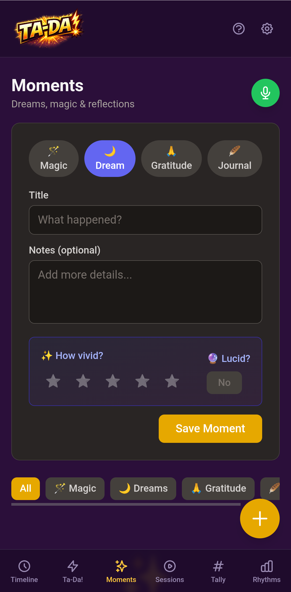

# Moments

  

**Capture the inner life.**

Dreams, ideas, gratitude, magic moments, reflections — the things worth remembering that don't fit neatly into categories. Moments is a journal that meets you where you are.

## What it does

- **Rich content** — Markdown-supported text for longer reflections
- **Mood tracking** — 1-5 scale to notice emotional patterns over time
- **Themes & tags** — Freeform categorization (e.g., "lucid", "flying" for dreams)
- **Voice input** — Speak your thoughts; AI can extract ta-das from reflections
- **Subcategories** — Dreams, gratitude, magic moments, journal entries, ideas

## Philosophy

Moments exists because not everything in life is an accomplishment or a timed session. Some of the most important things — a vivid dream, a moment of unexpected joy, an idea that won't let go — are worth noticing precisely because they're fleeting.

The mood tracking isn't prescriptive. It's a gentle prompt to check in with yourself, and over time it reveals patterns you might not have noticed otherwise.

## Module definition

| Field | Value |
|-------|-------|
| Type | `moment` |
| Label | Moments |
| Emoji | ✨ |
| Requires | — |
| Quick Add | Order 4, purple |

## Code

| Path | Purpose |
|------|---------|
| `app/modules/entry-types/moment/index.ts` | Module definition & registration |
| `app/modules/entry-types/moment/MomentInput.vue` | Input component |
| `app/pages/moments.vue` | Convenience route |

---

[Back to modules](./README.md)
