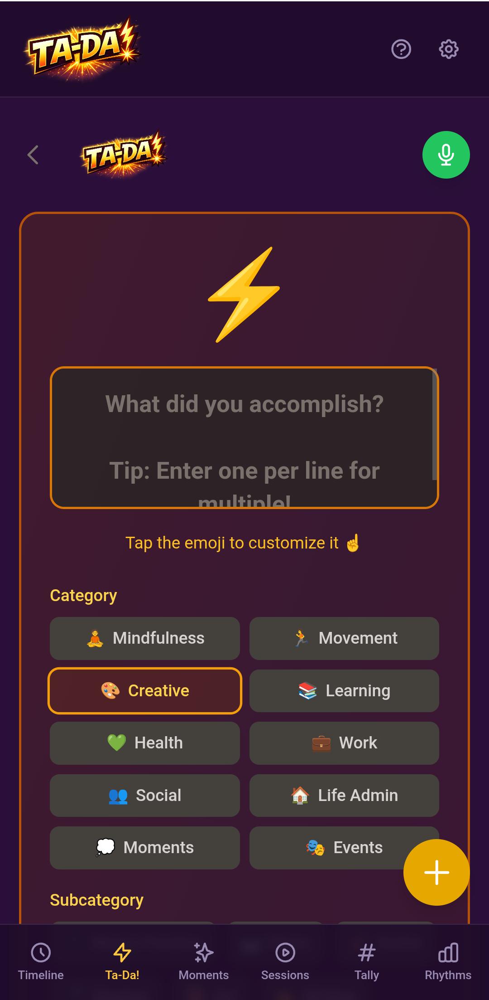

# Ta-Da! Wins

  

**Celebrate accomplishments as they happen.**

The namesake module. Ta-Da! inverts the todo list — instead of anxiety about what you haven't done, it celebrates what you have. Every win, from "finished the painting" to "called mom", deserves a moment of recognition.

## What it does

- **Quick capture** — Type or speak your accomplishment
- **Voice input** — AI extracts and structures multiple ta-das from natural speech ("I finished the report, cleaned the kitchen, and went for a run")
- **Significance levels** — Minor, normal, or major (with escalating celebration effects)
- **Celebration effects** — Confetti animation, sound effects, and encouraging messages
- **Batch creation** — Voice input can create multiple ta-das from a single utterance

## Philosophy

> "We don't want to tell people what they should be doing. We want to help them notice what they actually did, and help them feel good about it."

The Ta-Da! module is the purest expression of the app's philosophy. It takes the most anxiety-inducing concept in productivity (the todo list) and flips it into celebration.

## Module definition

| Field | Value |
|-------|-------|
| Type | `tada` |
| Label | Ta-Da! |
| Emoji | ⚡ |
| Requires | — |
| Quick Add | Order 1, amber |

## Code

| Path | Purpose |
|------|---------|
| `app/modules/entry-types/tada/index.ts` | Module definition & registration |
| `app/modules/entry-types/tada/TadaInput.vue` | Input component |
| `app/pages/tada/index.vue` | Convenience route |

---

[Back to modules](./README.md)
