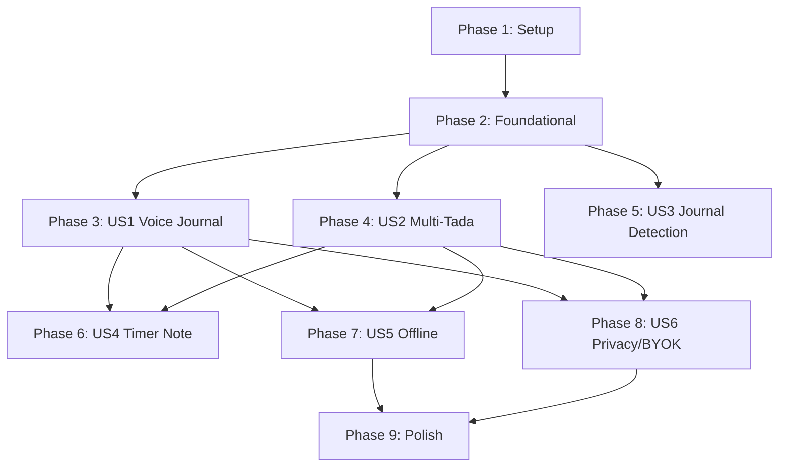

# Tasks: Voice Input with LLM Processing

**Input**: Design documents from `/specs/003-voice-input-llm/`  
**Prerequisites**: plan.md ✅, spec.md ✅, research.md ✅, data-model.md ✅, contracts/ ✅, quickstart.md ✅

**Tests**: Unit tests included for core extraction logic per quickstart.md Definition of Done.

**Organization**: Tasks grouped by user story to enable independent implementation and testing.

## Format: `[ID] [P?] [Story?] Description`

- **[P]**: Can run in parallel (different files, no dependencies)
- **[Story]**: Which user story this task belongs to (e.g., US1, US2, US3)
- Include exact file paths in descriptions

---

## Phase 1: Setup (Shared Infrastructure)

**Purpose**: Project initialization, types, and directory structure

- [x] T001 Create voice components directory at app/components/voice/
- [x] T002 Create workers directory at app/workers/
- [x] T003 [P] Create TypeScript types for voice features in app/types/voice.ts
- [x] T004 [P] Create TypeScript types for LLM extraction in app/types/extraction.ts
- [x] T005 [P] Add environment variables to .env.example (GROQ_API_KEY, VOICE_ENABLED, VOICE_FREE_LIMIT)
- [x] T006 [P] Add voice feature flags to app/nuxt.config.ts runtimeConfig

**Checkpoint**: Directory structure and types ready for implementation. ✅

---

## Phase 2: Foundational (Blocking Prerequisites)

**Purpose**: Core infrastructure that MUST be complete before ANY user story can be implemented

**⚠️ CRITICAL**: No user story work can begin until this phase is complete

### Voice Capture Foundation

- [x] T007 Create useVoiceCapture composable skeleton in app/composables/useVoiceCapture.ts
- [x] T008 Implement MediaRecorder initialization with getUserMedia in app/composables/useVoiceCapture.ts
- [x] T009 Add startRecording() method with chunks collection in app/composables/useVoiceCapture.ts
- [x] T010 Add stopRecording() method that creates Blob in app/composables/useVoiceCapture.ts
- [x] T011 Add audio level visualization with AnalyserNode in app/composables/useVoiceCapture.ts
- [x] T012 Add microphone permission request handling in app/composables/useVoiceCapture.ts
- [x] T013 Add recording time limit (5 minutes max) in app/composables/useVoiceCapture.ts
- [x] T014 Write unit tests for useVoiceCapture in app/composables/useVoiceCapture.test.ts

### Browser Detection

- [x] T015 Create browser capability detection util in app/utils/voiceBrowserSupport.ts
- [x] T016 Add Web Speech API detection (Chrome, Safari, Edge) in app/utils/voiceBrowserSupport.ts
- [x] T017 Add MediaRecorder codec detection in app/utils/voiceBrowserSupport.ts
- [x] T018 Add WebGPU availability check for future WebLLM in app/utils/voiceBrowserSupport.ts

### Settings Infrastructure

- [x] T019 Create useVoiceSettings composable skeleton in app/composables/useVoiceSettings.ts
- [x] T020 Add sttProvider preference (auto/web-speech/whisper-wasm/cloud) in app/composables/useVoiceSettings.ts
- [x] T021 Add llmProvider preference (auto/on-device/groq/openai/anthropic) in app/composables/useVoiceSettings.ts
- [x] T022 Add preferOffline toggle in app/composables/useVoiceSettings.ts
- [x] T023 Persist voice settings to user preferences in app/composables/useVoiceSettings.ts

**Checkpoint**: Foundation ready - voice capture works, settings persist, browser detection complete. ✅

---

## Phase 3: User Story 1 - Voice Journal Entry (Priority: P1) 🎯 MVP

**Goal**: User can dictate a dream or reflection and save it as a journal entry

**Independent Test**: Tap microphone → speak → see transcription → edit → save. Entry appears with `source: "voice"`.

### Recording UI Components

- [x] T024 [US1] Create VoiceRecorder.vue component skeleton in app/components/voice/VoiceRecorder.vue
- [x] T025 [US1] Add microphone button with idle state styling in app/components/voice/VoiceRecorder.vue
- [x] T026 [US1] Add recording state with pulsing animation in app/components/voice/VoiceRecorder.vue
- [x] T027 [US1] Add audio level indicator (waveform bars) in app/components/voice/VoiceRecorder.vue
- [x] T028 [US1] Add recording duration display (mm:ss) in app/components/voice/VoiceRecorder.vue
- [x] T029 [US1] Add stop button during recording in app/components/voice/VoiceRecorder.vue
- [x] T030 [US1] Add permission denied error state in app/components/voice/VoiceRecorder.vue
- [x] T031 [P] [US1] Create VoiceStatusIndicator.vue for processing states in app/components/voice/VoiceStatusIndicator.vue
- [x] T032 [US1] Add "Recording...", "Transcribing...", "Processing..." states in app/components/voice/VoiceStatusIndicator.vue

### Transcription (Web Speech API First)

- [x] T033 [US1] Create useTranscription composable skeleton in app/composables/useTranscription.ts
- [x] T034 [US1] Implement Web Speech API recognition in app/composables/useTranscription.ts
- [x] T035 [US1] Add Safari webkitSpeechRecognition prefix handling in app/composables/useTranscription.ts
- [x] T036 [US1] Add interim results display during speech in app/composables/useTranscription.ts
- [x] T037 [US1] Add final result extraction with confidence in app/composables/useTranscription.ts
- [x] T038 [US1] Add timeout handling (no speech detected) in app/composables/useTranscription.ts
- [x] T039 [US1] Add error handling (network, not-allowed, aborted) in app/composables/useTranscription.ts
- [x] T040 [US1] Add Firefox fallback message (Web Speech not supported) in app/composables/useTranscription.ts

### Review Modal

- [x] T041 [US1] Create VoiceReviewModal.vue component skeleton in app/components/voice/VoiceReviewModal.vue
- [x] T042 [US1] Add transcription text display in app/components/voice/VoiceReviewModal.vue
- [x] T043 [US1] Add editable textarea for transcription in app/components/voice/VoiceReviewModal.vue
- [x] T044 [US1] Add entry type selector (journal default) in app/components/voice/VoiceReviewModal.vue
- [x] T045 [US1] Add category dropdown in app/components/voice/VoiceReviewModal.vue
- [x] T046 [US1] Add subcategory dropdown in app/components/voice/VoiceReviewModal.vue
- [x] T047 [US1] Add Save and Cancel buttons in app/components/voice/VoiceReviewModal.vue
- [x] T048 [US1] Add "Re-record" option in app/components/voice/VoiceReviewModal.vue

### Entry Creation

- [x] T049 [US1] Add voice entry creation to useEntrySave composable in app/composables/useEntrySave.ts
- [x] T050 [US1] Set source: "voice" and voiceTranscription in data field in app/composables/useEntrySave.ts
- [x] T051 [US1] Add processingMethod tracking in entry data in app/composables/useEntrySave.ts

### Integration with Add Page

- [x] T052 [US1] Add VoiceRecorder to add.vue page in app/pages/add.vue
- [x] T053 [US1] Wire VoiceRecorder → VoiceReviewModal flow in app/pages/add.vue
- [x] T054 [US1] Add success toast after voice entry save in app/pages/add.vue
- [x] T055 [US1] Handle empty transcription gracefully in app/pages/add.vue

**Checkpoint**: User Story 1 complete - voice journal capture works end-to-end.

---

## Phase 4: User Story 2 - Voice Tada with Multi-Extract (Priority: P1) 🎯 MVP

**Goal**: User can ramble about their day and have multiple ta-das extracted as a checklist

**Independent Test**: Say "Today I fixed the sink, called my mom, and finally finished that book" → see 3 proposed ta-das → accept/dismiss each → save selected ones.

### Extraction Logic

- [x] T056 [US2] Create tadaExtractor.ts utility skeleton in app/utils/tadaExtractor.ts
- [x] T057 [US2] Define EXTRACTION_PROMPT constant with JSON schema in app/utils/tadaExtractor.ts
- [x] T058 [US2] Add "finally"/"at last" → major significance rule in prompt in app/utils/tadaExtractor.ts
- [x] T059 [US2] Add compound sentence splitting instruction in prompt in app/utils/tadaExtractor.ts
- [x] T060 [US2] Implement extractTadas() function with LLM call in app/utils/tadaExtractor.ts
- [x] T061 [US2] Add JSON response parsing with validation in app/utils/tadaExtractor.ts
- [x] T062 [US2] Add error handling for malformed LLM responses in app/utils/tadaExtractor.ts
- [x] T063 [P] [US2] Write unit tests with mock LLM in app/utils/tadaExtractor.test.ts
- [x] T064 [P] [US2] Add test case: compound sentence → 3 tadas in app/utils/tadaExtractor.test.ts
- [x] T065 [P] [US2] Add test case: "finally" → major significance in app/utils/tadaExtractor.test.ts

### LLM Integration Composable

- [x] T066 [US2] Create useLLMStructure composable skeleton in app/composables/useLLMStructure.ts
- [x] T067 [US2] Add Groq API client initialization in app/composables/useLLMStructure.ts
- [x] T068 [US2] Implement extractFromTranscription() with Groq call in app/composables/useLLMStructure.ts
- [x] T069 [US2] Add response_format: json_object for reliable parsing in app/composables/useLLMStructure.ts
- [x] T070 [US2] Add token usage tracking for billing in app/composables/useLLMStructure.ts
- [x] T071 [US2] Add timeout and retry logic (3 attempts) in app/composables/useLLMStructure.ts
- [x] T072 [US2] Add provider switching (Groq → OpenAI fallback) in app/composables/useLLMStructure.ts

### Category Matching Fallback

- [x] T073 [P] [US2] Create categoryMatcher.ts for rule-based fallback in app/utils/categoryMatcher.ts
- [x] T074 [US2] Add keyword → category mapping (home, work, health, etc.) in app/utils/categoryMatcher.ts
- [x] T075 [US2] Add subcategory detection from keywords in app/utils/categoryMatcher.ts

### Tada Checklist UI

- [x] T076 [US2] Create TadaChecklistReview.vue skeleton in app/components/voice/TadaChecklistReview.vue
- [x] T077 [US2] Add list of extracted tadas with checkboxes in app/components/voice/TadaChecklistReview.vue
- [x] T078 [US2] Add "Select All" / "Deselect All" buttons in app/components/voice/TadaChecklistReview.vue
- [x] T079 [US2] Add tada count summary (e.g., "3 tadas found") in app/components/voice/TadaChecklistReview.vue
- [x] T080 [US2] Add "Show more" for 5+ tadas in app/components/voice/TadaChecklistReview.vue
- [x] T081 [US2] Add confidence indicator per tada (high/medium/low) in app/components/voice/TadaChecklistReview.vue
- [x] T082 [US2] Add Save Selected button in app/components/voice/TadaChecklistReview.vue
- [x] T083 [US2] Handle zero tadas extracted (offer journal fallback) in app/components/voice/TadaChecklistReview.vue

### Tada Checklist Item

- [x] T084 [P] [US2] Create TadaChecklistItem.vue skeleton in app/components/voice/TadaChecklistItem.vue
- [x] T085 [US2] Add checkbox with tada title display in app/components/voice/TadaChecklistItem.vue
- [x] T086 [US2] Add category badge/chip in app/components/voice/TadaChecklistItem.vue
- [x] T087 [US2] Add significance indicator (minor/normal/major) in app/components/voice/TadaChecklistItem.vue
- [x] T088 [US2] Add inline edit mode (tap to expand) in app/components/voice/TadaChecklistItem.vue
- [x] T089 [US2] Add title editing in expanded mode in app/components/voice/TadaChecklistItem.vue
- [x] T090 [US2] Add category selector in expanded mode in app/components/voice/TadaChecklistItem.vue
- [x] T091 [US2] Add significance selector in expanded mode in app/components/voice/TadaChecklistItem.vue

### Batch Entry Creation

- [x] T092 [US2] Add batch tada creation to useEntrySave in app/composables/useEntrySave.ts
- [x] T093 [US2] Create all selected entries in single transaction in app/composables/useEntrySave.ts
- [x] T094 [US2] Link entries via extractedFrom field (parent transcription ID) in app/composables/useEntrySave.ts
- [x] T095 [US2] Add success toast with count ("3 tadas saved!") in app/composables/useEntrySave.ts

### Integration with Add Page

- [x] T096 [US2] Add "Tada mode" toggle to VoiceRecorder in app/components/voice/VoiceRecorder.vue
- [x] T097 [US2] Route to TadaChecklistReview when in tada mode in app/pages/add.vue
- [x] T098 [US2] Add loading state during LLM extraction in app/pages/add.vue

**Checkpoint**: User Story 2 complete - multi-tada extraction works with checklist review.

---

## Phase 5: User Story 3 - Journal Type Detection (Priority: P1)

**Goal**: System auto-detects dream/reflection/gratitude/note from voice content

**Independent Test**: Say "I had this weird dream where I was flying" → subcategory auto-set to "dream".

### Detection Logic

- [x] T099 [US3] Create useJournalTypeDetection composable in app/composables/useJournalTypeDetection.ts
- [x] T100 [US3] Add dream detection keywords (dream, dreamed, sleeping, nightmare) in app/composables/useJournalTypeDetection.ts
- [x] T101 [US3] Add gratitude detection keywords (grateful, thankful, appreciate) in app/composables/useJournalTypeDetection.ts
- [x] T102 [US3] Add reflection detection keywords (thinking about, realized, wondering) in app/composables/useJournalTypeDetection.ts
- [x] T103 [US3] Add detectJournalType() function with confidence score in app/composables/useJournalTypeDetection.ts
- [x] T104 [US3] Add signals array (which keywords matched) in app/composables/useJournalTypeDetection.ts
- [x] T105 [US3] Default to "note" when confidence < 0.6 in app/composables/useJournalTypeDetection.ts
- [x] T106 [P] [US3] Write unit tests for detection in app/composables/useJournalTypeDetection.test.ts
- [x] T107 [P] [US3] Add test case: "I dreamed..." → dream in app/composables/useJournalTypeDetection.test.ts
- [x] T108 [P] [US3] Add test case: ambiguous → note in app/composables/useJournalTypeDetection.test.ts

### Integration with LLM

- [x] T109 [US3] Add journalType to extraction prompt in app/utils/tadaExtractor.ts
- [x] T110 [US3] Merge LLM detection with keyword detection (prefer LLM when confident) in app/composables/useJournalTypeDetection.ts

### UI Updates

- [x] T111 [US3] Auto-select subcategory in VoiceReviewModal in app/components/voice/VoiceReviewModal.vue
- [x] T112 [US3] Show detection confidence indicator in app/components/voice/VoiceReviewModal.vue
- [x] T113 [US3] Allow easy override of detected type in app/components/voice/VoiceReviewModal.vue
- [x] T114 [US3] Show "Detected as dream" hint with change button in app/components/voice/VoiceReviewModal.vue

**Checkpoint**: User Story 3 complete - journal type auto-detected with easy override.

---

## Phase 6: User Story 4 - Voice Timer Note (Priority: P2)

**Goal**: User can add voice reflection after completing a timer session

**Independent Test**: Complete timer → tap "Add voice note" → speak reflection → see it in entry notes.

### Timer Integration

- [x] T115 [US4] Add VoiceRecorder mini button to timer completion in app/pages/timer.vue
- [x] T116 [US4] Add "Add voice note" button after timer stops in app/pages/timer.vue
- [x] T117 [US4] Create compact VoiceRecorder variant for inline use in app/components/voice/VoiceRecorder.vue
- [x] T118 [US4] Handle timer-note context in useTranscription in app/composables/useTranscription.ts

### Quality Rating Extraction

- [x] T119 [US4] Add quality rating extraction from phrases in app/utils/tadaExtractor.ts
- [x] T120 [US4] Map "great session" → 5, "okay" → 3, "difficult" → 2 in app/utils/tadaExtractor.ts
- [X] T121 [US4] Auto-fill quality rating in timer entry in app/pages/timer.vue

### Bonus Tada Detection

- [x] T122 [US4] Detect bonus tadas in timer notes ("also I fixed...") in app/utils/tadaExtractor.ts
- [X] T123 [US4] Show quick-accept for bonus tadas in timer flow in app/pages/timer.vue
- [X] T124 [US4] Create both timer entry and bonus tada entries in app/pages/timer.vue

### Entry Notes

- [x] T125 [US4] Add voice transcription to timer entry notes field in app/pages/timer.vue
- [X] T126 [US4] Format voice note nicely in entry display in app/pages/entry/[id].vue

**Checkpoint**: User Story 4 complete - voice notes work in timer flow.

---

## Phase 7: User Story 5 - Offline Voice Capture (Priority: P3)

**Goal**: User can record voice offline and have it processed when connection restores

**Independent Test**: Turn off network → record voice → see "Pending" indicator → restore network → see entry created.

### IndexedDB Queue

- [x] T127 [US5] Create useVoiceQueue composable skeleton in app/composables/useVoiceQueue.ts
- [x] T128 [US5] Initialize IndexedDB store "voice_queue" in app/composables/useVoiceQueue.ts
- [x] T129 [US5] Implement addToQueue() with audio blob storage in app/composables/useVoiceQueue.ts
- [x] T130 [US5] Implement getQueue() to list pending items in app/composables/useVoiceQueue.ts
- [x] T131 [US5] Implement removeFromQueue() after success in app/composables/useVoiceQueue.ts
- [x] T132 [US5] Add status field (pending/processing/failed) in app/composables/useVoiceQueue.ts
- [x] T133 [US5] Add retryCount and error tracking in app/composables/useVoiceQueue.ts
- [x] T134 [P] [US5] Write unit tests for queue operations in app/composables/useVoiceQueue.test.ts

### Network Detection

- [x] T135 [US5] Add online/offline detection in app/composables/useVoiceQueue.ts
- [x] T136 [US5] Listen to navigator.onLine changes in app/composables/useVoiceQueue.ts
- [x] T137 [US5] Queue recordings when offline instead of processing in app/composables/useTranscription.ts

### Background Processing

- [x] T138 [US5] Process queue on reconnect in app/composables/useVoiceQueue.ts
- [x] T139 [US5] Add processQueue() that runs pending items in app/composables/useVoiceQueue.ts
- [x] T140 [US5] Show notification when queued items processed in app/composables/useVoiceQueue.ts
- [x] T141 [US5] Handle partial failures (some succeed, some fail) in app/composables/useVoiceQueue.ts

### UI Indicators

- [x] T142 [US5] Add pending count badge to add page in app/pages/add.vue
- [x] T143 [US5] Add "Offline - will process later" message in app/components/voice/VoiceStatusIndicator.vue
- [x] T144 [US5] Add retry button for failed items in app/components/voice/VoiceStatusIndicator.vue
- [x] T145 [US5] Add queue management in settings in app/pages/settings.vue

**Checkpoint**: User Story 5 complete - offline recording with background sync works.

---

## Phase 8: User Story 6 - Privacy-First & BYOK (Priority: P2)

**Goal**: Privacy-conscious users can use on-device processing or bring their own API keys

**Independent Test**: Enable "On-device processing" → record → see "Processing on device" indicator.

### API Key Encryption

- [x] T146 [P] [US6] Create apiKeyEncryption.ts utility in app/utils/apiKeyEncryption.ts
- [x] T147 [US6] Implement encryptApiKey() with Web Crypto AES-GCM in app/utils/apiKeyEncryption.ts
- [x] T148 [US6] Implement decryptApiKey() in app/utils/apiKeyEncryption.ts
- [x] T149 [US6] Use PBKDF2 with 100k iterations for key derivation in app/utils/apiKeyEncryption.ts
- [x] T150 [US6] Generate random IV per encryption in app/utils/apiKeyEncryption.ts
- [x] T151 [P] [US6] Write unit tests for encryption roundtrip in app/utils/apiKeyEncryption.test.ts

### Settings UI

- [x] T152 [US6] Create VoiceSettings.vue component in app/components/settings/VoiceSettings.vue
- [x] T153 [US6] Add STT provider selector (Auto/Web Speech/Whisper/Cloud) in app/components/settings/VoiceSettings.vue
- [x] T154 [US6] Add LLM provider selector (Auto/On-device/Groq/OpenAI/Anthropic) in app/components/settings/VoiceSettings.vue
- [x] T155 [US6] Add "Prefer offline processing" toggle in app/components/settings/VoiceSettings.vue
- [x] T156 [US6] Add API key input for OpenAI in app/components/settings/VoiceSettings.vue
- [x] T157 [US6] Add API key input for Anthropic in app/components/settings/VoiceSettings.vue
- [x] T158 [US6] Add API key input for Groq in app/components/settings/VoiceSettings.vue
- [x] T159 [US6] Mask API key display (show last 4 chars only) in app/components/settings/VoiceSettings.vue
- [x] T160 [US6] Add "Test connection" button per provider in app/components/settings/VoiceSettings.vue
- [x] T161 [US6] Add "Remove key" button per provider in app/components/settings/VoiceSettings.vue

### Key Validation

- [x] T162 [US6] Create key validation endpoint in app/server/api/voice/validate-key.post.ts
- [x] T163 [US6] Test OpenAI key with minimal API call in app/server/api/voice/validate-key.post.ts
- [x] T164 [US6] Test Anthropic key with minimal API call in app/server/api/voice/validate-key.post.ts
- [x] T165 [US6] Test Groq key with minimal API call in app/server/api/voice/validate-key.post.ts
- [x] T166 [US6] Return validation success/error to client in app/server/api/voice/validate-key.post.ts

### Cloud API Endpoints

- [x] T167 [US6] Create transcribe.post.ts endpoint skeleton in app/server/api/voice/transcribe.post.ts
- [x] T168 [US6] Accept multipart/form-data audio upload in app/server/api/voice/transcribe.post.ts
- [x] T169 [US6] Implement Whisper API transcription in app/server/api/voice/transcribe.post.ts
- [x] T170 [US6] Support BYOK (userApiKey parameter) in app/server/api/voice/transcribe.post.ts
- [x] T171 [US6] Delete audio after transcription (never persist) in app/server/api/voice/transcribe.post.ts
- [x] T172 [P] [US6] Create structure.post.ts endpoint skeleton in app/server/api/voice/structure.post.ts
- [x] T173 [US6] Accept text and context in request body in app/server/api/voice/structure.post.ts
- [x] T174 [US6] Implement Groq LLM call with extraction prompt in app/server/api/voice/structure.post.ts
- [x] T175 [US6] Support BYOK for OpenAI/Anthropic in app/server/api/voice/structure.post.ts
- [x] T176 [US6] Track tokens used for billing in app/server/api/voice/structure.post.ts

### Usage Tracking

- [x] T177 [US6] Create usage.get.ts endpoint in app/server/api/voice/usage.get.ts
- [x] T178 [US6] Return voiceEntriesThisMonth count in app/server/api/voice/usage.get.ts
- [x] T179 [US6] Return voiceEntriesLimit based on tier in app/server/api/voice/usage.get.ts
- [x] T180 [US6] Return resetDate for billing period in app/server/api/voice/usage.get.ts
- [x] T181 [US6] Increment usage counter on voice entry save in app/composables/useEntrySave.ts

### Rate Limiting

- [x] T182 [US6] Add free tier limit check (50/month) in app/server/api/voice/transcribe.post.ts
- [x] T183 [US6] Add free tier limit check (50/month) in app/server/api/voice/structure.post.ts
- [x] T184 [US6] Return 402 when limit exceeded with upgrade message in app/server/api/voice/transcribe.post.ts
- [x] T185 [US6] Show usage count in settings in app/components/settings/VoiceSettings.vue

### Privacy Disclosure

- [x] T186 [US6] Add privacy disclosure modal on first voice use in app/components/voice/VoicePrivacyDisclosure.vue
- [x] T187 [US6] Explain Web Speech API sends audio to Google in app/components/voice/VoicePrivacyDisclosure.vue
- [x] T188 [US6] Explain cloud processing options in app/components/voice/VoicePrivacyDisclosure.vue
- [x] T189 [US6] Add "Don't show again" with preferences save in app/components/voice/VoicePrivacyDisclosure.vue
- [x] T190 [US6] Show disclosure before first recording in app/components/voice/VoiceRecorder.vue

### Processing Indicator

- [x] T191 [US6] Show "Processing on device" in VoiceStatusIndicator in app/components/voice/VoiceStatusIndicator.vue
- [x] T192 [US6] Show "Sending to cloud..." when cloud used in app/components/voice/VoiceStatusIndicator.vue
- [x] T193 [US6] Show provider name when using cloud (Groq, OpenAI, etc.) in app/components/voice/VoiceStatusIndicator.vue

### Settings Integration

- [x] T194 [US6] Add VoiceSettings to settings page in app/pages/settings.vue
- [x] T195 [US6] Add "Voice & AI" section header in app/pages/settings.vue

**Checkpoint**: User Story 6 complete - privacy controls and BYOK work.

---

## Phase 9: Polish & Cross-Cutting Concerns

**Purpose**: Improvements that affect multiple user stories

### Whisper WASM Worker (Advanced Offline)

- [ ] T196 [P] Create whisper.worker.ts skeleton in app/workers/whisper.worker.ts
- [ ] T197 Add transformers.js Whisper model loading in app/workers/whisper.worker.ts
- [ ] T198 Implement transcribe message handler in app/workers/whisper.worker.ts
- [ ] T199 Add model download progress reporting in app/workers/whisper.worker.ts
- [ ] T200 Create model download UI with progress bar in app/components/voice/ModelDownloadProgress.vue
- [ ] T201 Add WiFi-only download option in app/components/settings/VoiceSettings.vue
- [ ] T202 Cache model in IndexedDB "model_cache" store in app/workers/whisper.worker.ts
- [ ] T203 Add Whisper WASM tier to useTranscription in app/composables/useTranscription.ts

### Browser Compatibility

- [x] T204 [P] Add Firefox graceful degradation message in app/components/voice/VoiceRecorder.vue
- [x] T205 [P] Add Safari audio format handling (MP4 vs WebM) in app/composables/useVoiceCapture.ts
- [x] T206 [P] Test and fix Edge-specific issues in app/components/voice/VoiceRecorder.vue

### Error Handling

- [x] T207 Add global voice error boundary in app/components/voice/VoiceErrorBoundary.vue
- [x] T208 Add retry logic for transient failures in app/composables/useTranscription.ts
- [x] T209 Add user-friendly error messages for all failure modes in app/components/voice/VoiceStatusIndicator.vue

### Accessibility

- [x] T210 [P] Add ARIA labels to recording controls in app/components/voice/VoiceRecorder.vue
- [x] T211 [P] Add keyboard shortcuts (Space to record/stop) in app/components/voice/VoiceRecorder.vue
- [x] T212 [P] Add screen reader announcements for state changes in app/components/voice/VoiceStatusIndicator.vue

### Performance

- [x] T213 # Nuxt auto-imports handle code splitting Lazy load voice components (code splitting) in app/pages/add.vue
- [ ] T214 Preload Whisper model on settings page visit in app/pages/settings.vue
- [ ] T215 Add recording start latency tracking (<100ms goal) in app/composables/useVoiceCapture.ts

### Documentation

- [X] T216 [P] Update quickstart.md Definition of Done checklist in specs/003-voice-input-llm/quickstart.md
- [X] T217 [P] Add voice feature to DEVELOPER_GUIDE.md in docs/DEVELOPER_GUIDE.md
- [X] T218 [P] Add voice API to README if user-facing in README.md

### Final Validation

- [ ] T219 Run full E2E test: tap mic → speak → see entry in journal in app/tests/
- [ ] T220 Verify 80% unit test coverage on extraction logic via bun run test:coverage
- [ ] T221 Test in Chrome, Safari, Edge - verify browser matrix from plan.md

**Checkpoint**: All polish complete - feature ready for release.

---

## Dependencies & Execution Order

### Phase Dependencies



### User Story Dependencies

| Story                   | Depends On                           | Can Parallel With |
| ----------------------- | ------------------------------------ | ----------------- |
| US1 (Voice Journal)     | Foundational                         | -                 |
| US2 (Multi-Tada)        | Foundational                         | US1               |
| US3 (Journal Detection) | Foundational                         | US1, US2          |
| US4 (Timer Note)        | US1 (recording UI), US2 (extraction) | US3               |
| US5 (Offline)           | US1, US2                             | US4, US6          |
| US6 (Privacy/BYOK)      | US1, US2                             | US4, US5          |

### Parallel Opportunities Within Phases

**Phase 1 (Setup)**:

```
T003, T004, T005, T006 can all run in parallel (different files)
```

**Phase 2 (Foundational)**:

```
T015-T018 (browser detection) parallel with T007-T014 (voice capture)
T019-T023 (settings) parallel with both above
```

**Phase 4 (US2 Multi-Tada)**:

```
T063-T065 (tests) parallel with T073-T075 (category matcher)
T084-T091 (TadaChecklistItem) parallel with T076-T083 (TadaChecklistReview) after skeleton
```

---

## Implementation Strategy

### MVP First (Week 1-2)

1. Complete Phase 1: Setup (T001-T006)
2. Complete Phase 2: Foundational (T007-T023)
3. Complete Phase 3: US1 Voice Journal (T024-T055)
4. **STOP and VALIDATE**: Test voice journal flow independently
5. Complete Phase 4: US2 Multi-Tada (T056-T098)
6. **STOP and VALIDATE**: Test multi-tada extraction
7. Complete Phase 5: US3 Journal Detection (T099-T114)

**MVP Deliverable**: Voice journal + multi-tada extraction + journal type detection

### Enhancement Phase (Week 3)

8. Phase 6: US4 Timer Note (T115-T126)
9. Phase 8: US6 Privacy/BYOK (T146-T195)

### Resilience Phase (Week 4)

10. Phase 7: US5 Offline (T127-T145)
11. Phase 9: Polish (T196-T221)

### Parallel Team Strategy

With 2 developers:

- **Dev A**: US1 → US2 (core voice path)
- **Dev B**: Browser detection → US3 → US6 Settings UI

---

## Notes

- [P] tasks = different files, no dependencies
- [US#] label maps task to specific user story
- Each user story is independently testable at checkpoint
- Commit after each task or logical group
- Web Speech API is sufficient for MVP - Whisper WASM is polish phase
- BYOK encryption uses Web Crypto API (no external dependencies)
- Audio is NEVER persisted - delete immediately after transcription
