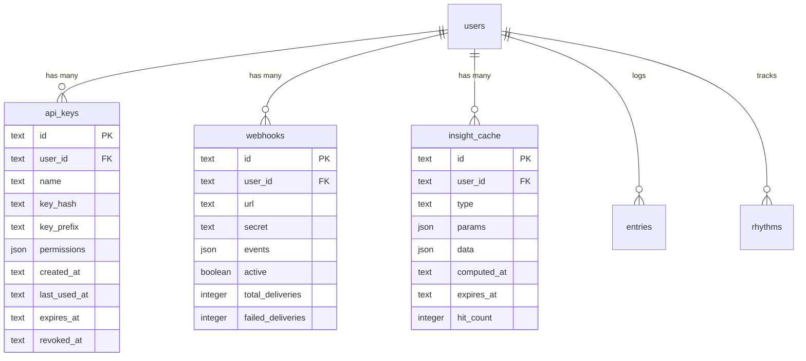

# Data Model: Ta-Da! REST API

**Date**: 2026-02-01
**Phase**: 1 - Design & Contracts
**Status**: Complete

## Overview

This document defines the database schema additions required for the Ta-Da! REST API. All tables use Drizzle ORM with SQLite as the storage engine.

## Existing Schema

**Already Available** (no modifications needed):
- `users` - User accounts with email, password hash, timezone
- `sessions` - Lucia Auth session management
- `entries` - Activity/event records (supports all API requirements)
- `rhythms` - Habit tracking definitions with streak calculation
- `attachments` - Media files linked to entries

## New Tables

### 1. API Keys

Stores hashed API keys with granular permissions for external integrations.

```typescript
import { sqliteTable, text, integer } from "drizzle-orm/sqlite-core"
import { sql } from "drizzle-orm"

export const apiKeys = sqliteTable("api_keys", {
  id: text("id").primaryKey(), // UUID
  userId: text("user_id")
    .notNull()
    .references(() => users.id, { onDelete: "cascade" }),

  // Key identification
  name: text("name").notNull(), // User-provided label: "OpenClaw Integration"
  keyHash: text("key_hash").notNull(), // bcrypt hash (cost 12) - NEVER store plaintext
  keyPrefix: text("key_prefix").notNull(), // First 16 chars for lookup: "tada_key_abc123"

  // Permissions (JSON array of strings)
  permissions: text("permissions", { mode: "json" })
    .$type<string[]>()
    .notNull()
    .default([]), // ['entries:read', 'rhythms:read', ...]

  // Lifecycle
  createdAt: text("created_at")
    .notNull()
    .default(sql`(datetime('now'))`),
  lastUsedAt: text("last_used_at"), // Timestamp of most recent auth
  expiresAt: text("expires_at"), // Optional expiration (ISO 8601)
  revokedAt: text("revoked_at"), // When key was revoked (soft delete)
})
```

**Indexes**:
```sql
CREATE UNIQUE INDEX idx_api_keys_prefix ON api_keys(keyPrefix);
CREATE INDEX idx_api_keys_user_active ON api_keys(userId, revokedAt);
```

**Permissions Schema**:
```typescript
type Permission =
  | 'entries:read'
  | 'entries:write'
  | 'rhythms:read'
  | 'insights:read'
  | 'export:read'
  | 'webhooks:manage'
  | 'user:read'
```

**Usage Example**:
```typescript
// Generate key
const apiKey = `tada_key_${crypto.randomBytes(24).toString('base64url')}`
const keyHash = await bcrypt.hash(apiKey, 12)
const keyPrefix = apiKey.slice(0, 16) // "tada_key_abc123"

await db.insert(apiKeys).values({
  id: crypto.randomUUID(),
  userId: user.id,
  name: "OpenClaw Integration",
  keyHash,
  keyPrefix,
  permissions: ['entries:read', 'rhythms:read', 'insights:read']
})

// Return apiKey to user ONLY ONCE (never stored in plaintext)
return { key: apiKey, prefix: keyPrefix }
```

---

### 2. Webhooks

Webhook subscriptions for real-time event notifications.

```typescript
export const webhooks = sqliteTable("webhooks", {
  id: text("id").primaryKey(), // UUID
  userId: text("user_id")
    .notNull()
    .references(() => users.id, { onDelete: "cascade" }),

  // Endpoint configuration
  url: text("url").notNull(), // HTTPS endpoint (validated)
  secret: text("secret").notNull(), // HMAC secret for signature verification
  description: text("description"), // Optional user note

  // Event subscriptions (JSON array)
  events: text("events", { mode: "json" })
    .$type<string[]>()
    .notNull()
    .default([]), // ['entry.created', 'streak.milestone', ...]

  // Status
  active: integer("active", { mode: "boolean" }).notNull().default(true),
  disabledReason: text("disabled_reason"), // Auto-disabled if too many failures

  // Delivery statistics
  lastTriggeredAt: text("last_triggered_at"), // Most recent delivery attempt
  lastSuccessAt: text("last_success_at"), // Most recent successful delivery
  totalDeliveries: integer("total_deliveries").notNull().default(0),
  failedDeliveries: integer("failed_deliveries").notNull().default(0),
  consecutiveFailures: integer("consecutive_failures").notNull().default(0),

  // Timestamps
  createdAt: text("created_at")
    .notNull()
    .default(sql`(datetime('now'))`),
  updatedAt: text("updated_at")
    .notNull()
    .default(sql`(datetime('now'))`),
})
```

**Indexes**:
```sql
CREATE INDEX idx_webhooks_user_active ON webhooks(userId, active);
CREATE INDEX idx_webhooks_events ON webhooks(userId, active) WHERE active = 1;
```

**Supported Events**:
```typescript
type WebhookEvent =
  | 'entry.created'     // New entry logged
  | 'entry.updated'     // Entry modified
  | 'entry.deleted'     // Entry soft deleted
  | 'streak.milestone'  // Hit 100, 500, 1000, etc. days
  | 'rhythm.broken'     // Streak interrupted (rare)
  | 'rhythm.completed'  // Daily/weekly goal met
  | 'pattern.detected'  // New correlation found
  | 'import.completed'  // CSV import finished
```

**Auto-disable Logic**:
- Disable if `consecutiveFailures >= 10`
- Disable if failure rate > 50% over last 20 deliveries
- Set `active = false`, `disabledReason = "High failure rate"`
- Send email notification to user

---

### 3. Insight Cache

Caches expensive pattern detection and correlation analysis results.

```typescript
export const insightCache = sqliteTable("insight_cache", {
  id: text("id").primaryKey(), // Composite key: `${userId}:${type}:${params}`
  userId: text("user_id")
    .notNull()
    .references(() => users.id, { onDelete: "cascade" }),

  // Cache key components
  type: text("type").notNull(), // 'patterns' | 'correlations' | 'summary'
  params: text("params", { mode: "json" })
    .$type<Record<string, any>>()
    .notNull(), // { lookback: 90, category: 'mindfulness', minConfidence: 'medium' }

  // Cached result
  data: text("data", { mode: "json" })
    .$type<any>()
    .notNull(), // Pattern detection results, summary stats, etc.

  // Metadata
  computeTimeMs: integer("compute_time_ms"), // How long it took to compute
  entryCount: integer("entry_count"), // How many entries were analyzed

  // Lifecycle
  computedAt: text("computed_at")
    .notNull()
    .default(sql`(datetime('now'))`),
  expiresAt: text("expires_at").notNull(), // computedAt + TTL (default 1 hour)
  hitCount: integer("hit_count").notNull().default(0), // Cache hit counter
})
```

**Indexes**:
```sql
CREATE INDEX idx_insight_cache_lookup ON insight_cache(userId, type, expiresAt);
CREATE INDEX idx_insight_cache_expiry ON insight_cache(expiresAt); -- For cleanup job
```

**Cache Key Format**:
```typescript
function getCacheKey(
  userId: string,
  type: 'patterns' | 'correlations' | 'summary',
  params: Record<string, any>
): string {
  // Sort params for consistent key
  const sortedParams = Object.keys(params)
    .sort()
    .map(k => `${k}:${JSON.stringify(params[k])}`)
    .join('|')

  return `${userId}:${type}:${sortedParams}`
}

// Example: "user_123:patterns:category:"mindfulness"|lookback:90|minConfidence:"high""
```

**TTL Strategy**:
```typescript
// Cache lifetime based on data volatility
const TTL_CONFIG = {
  patterns: 3600 * 1000,      // 1 hour (patterns change slowly)
  correlations: 1800 * 1000,  // 30 min (more granular)
  summary: 600 * 1000,        // 10 min (frequently updated)
}

// Auto-cleanup: Daily cron job deletes expired entries
DELETE FROM insight_cache WHERE expiresAt < datetime('now')
```

---

### 4. Rate Limit Logs (Optional - Phase 3)

Persistent audit log for rate limit events. Not required for MVP (in-memory cache sufficient).

```typescript
export const rateLimitLogs = sqliteTable("rate_limit_logs", {
  id: text("id").primaryKey(), // UUID
  apiKeyId: text("api_key_id")
    .references(() => apiKeys.id, { onDelete: "cascade" }),
  userId: text("user_id")
    .references(() => users.id, { onDelete: "cascade" }),

  // Request details
  endpoint: text("endpoint").notNull(), // '/api/v1/entries'
  method: text("method").notNull(), // 'GET', 'POST', etc.
  ipAddress: text("ip_address"),
  userAgent: text("user_agent"),

  // Rate limit info
  rateLimitType: text("rate_limit_type").notNull(), // 'standard', 'export', 'pattern'
  allowed: integer("allowed", { mode: "boolean" }).notNull(), // true if request proceeded
  currentCount: integer("current_count").notNull(), // Count at time of request
  limit: integer("limit").notNull(), // Configured limit
  windowStart: text("window_start").notNull(), // Start of rate limit window

  // Timestamp
  createdAt: text("created_at")
    .notNull()
    .default(sql`(datetime('now'))`),
})
```

**Note**: Defer to Phase 3. MVP uses in-memory rate limiting only.

---

## Schema Migration

### Migration File: `0003_api_tables.sql`

```sql
-- Add API Keys table
CREATE TABLE api_keys (
  id TEXT PRIMARY KEY,
  user_id TEXT NOT NULL REFERENCES users(id) ON DELETE CASCADE,
  name TEXT NOT NULL,
  key_hash TEXT NOT NULL,
  key_prefix TEXT NOT NULL,
  permissions TEXT NOT NULL DEFAULT '[]',
  created_at TEXT NOT NULL DEFAULT (datetime('now')),
  last_used_at TEXT,
  expires_at TEXT,
  revoked_at TEXT
);

CREATE UNIQUE INDEX idx_api_keys_prefix ON api_keys(key_prefix);
CREATE INDEX idx_api_keys_user_active ON api_keys(user_id, revoked_at);

-- Add Webhooks table
CREATE TABLE webhooks (
  id TEXT PRIMARY KEY,
  user_id TEXT NOT NULL REFERENCES users(id) ON DELETE CASCADE,
  url TEXT NOT NULL,
  secret TEXT NOT NULL,
  description TEXT,
  events TEXT NOT NULL DEFAULT '[]',
  active INTEGER NOT NULL DEFAULT 1,
  disabled_reason TEXT,
  last_triggered_at TEXT,
  last_success_at TEXT,
  total_deliveries INTEGER NOT NULL DEFAULT 0,
  failed_deliveries INTEGER NOT NULL DEFAULT 0,
  consecutive_failures INTEGER NOT NULL DEFAULT 0,
  created_at TEXT NOT NULL DEFAULT (datetime('now')),
  updated_at TEXT NOT NULL DEFAULT (datetime('now'))
);

CREATE INDEX idx_webhooks_user_active ON webhooks(user_id, active);

-- Add Insight Cache table
CREATE TABLE insight_cache (
  id TEXT PRIMARY KEY,
  user_id TEXT NOT NULL REFERENCES users(id) ON DELETE CASCADE,
  type TEXT NOT NULL,
  params TEXT NOT NULL,
  data TEXT NOT NULL,
  compute_time_ms INTEGER,
  entry_count INTEGER,
  computed_at TEXT NOT NULL DEFAULT (datetime('now')),
  expires_at TEXT NOT NULL,
  hit_count INTEGER NOT NULL DEFAULT 0
);

CREATE INDEX idx_insight_cache_lookup ON insight_cache(user_id, type, expires_at);
CREATE INDEX idx_insight_cache_expiry ON insight_cache(expires_at);

-- Add indexes to entries table for API query performance
CREATE INDEX IF NOT EXISTS idx_entries_user_time ON entries(user_id, timestamp DESC);
CREATE INDEX IF NOT EXISTS idx_entries_user_type_cat ON entries(user_id, type, category);
CREATE INDEX IF NOT EXISTS idx_entries_user_deleted ON entries(user_id, deleted_at);
```

### Running Migration

```bash
# Generate migration
bun run db:generate

# Apply migration
bun run db:migrate

# Verify
bun --print "SELECT name FROM sqlite_master WHERE type='table' AND name IN ('api_keys', 'webhooks', 'insight_cache')"
```

---

## Data Relationships



---

## Type Definitions

### TypeScript Types

```typescript
// app/types/api.d.ts

export interface ApiKey {
  id: string
  userId: string
  name: string
  keyHash: string
  keyPrefix: string
  permissions: Permission[]
  createdAt: string
  lastUsedAt: string | null
  expiresAt: string | null
  revokedAt: string | null
}

export type Permission =
  | 'entries:read'
  | 'entries:write'
  | 'rhythms:read'
  | 'insights:read'
  | 'export:read'
  | 'webhooks:manage'
  | 'user:read'

export interface Webhook {
  id: string
  userId: string
  url: string
  secret: string
  description?: string
  events: WebhookEvent[]
  active: boolean
  disabledReason?: string
  lastTriggeredAt?: string
  lastSuccessAt?: string
  totalDeliveries: number
  failedDeliveries: number
  consecutiveFailures: number
  createdAt: string
  updatedAt: string
}

export type WebhookEvent =
  | 'entry.created'
  | 'entry.updated'
  | 'entry.deleted'
  | 'streak.milestone'
  | 'rhythm.broken'
  | 'rhythm.completed'
  | 'pattern.detected'
  | 'import.completed'

export interface InsightCache {
  id: string
  userId: string
  type: 'patterns' | 'correlations' | 'summary'
  params: Record<string, any>
  data: any
  computeTimeMs?: number
  entryCount?: number
  computedAt: string
  expiresAt: string
  hitCount: number
}

export interface WebhookPayload<T = any> {
  event: WebhookEvent
  timestamp: string // ISO 8601
  data: T
  webhook: {
    id: string
  }
}
```

---

## Security Considerations

### API Key Security

1. **Never Store Plaintext**: Always hash with bcrypt (cost 12+)
2. **Constant-Time Comparison**: Use `crypto.timingSafeEqual()` for validation
3. **Prefix Lookup**: Use `keyPrefix` index to narrow search before hashing
4. **Audit Trail**: Log `lastUsedAt` on every authenticated request
5. **Rotation**: Encourage users to rotate keys periodically (90 days)

### Webhook Security

1. **HTTPS Only**: Validate webhook URLs use HTTPS protocol
2. **HMAC Signatures**: Sign all payloads with SHA-256 HMAC
3. **Replay Protection**: Include timestamp in signature
4. **URL Validation**: Reject private IP ranges, localhost, etc.
5. **Rate Limiting**: Limit webhook creation (5 per user)

### Cache Security

1. **User Isolation**: Always include `userId` in cache key
2. **Data Sanitization**: Validate cached data before serving
3. **Expiration**: Enforce TTL to prevent stale data
4. **Size Limits**: Limit cached data size (1MB per entry)

---

## Performance Optimizations

### Database Configuration

```typescript
// Enable WAL mode for concurrent reads during writes
PRAGMA journal_mode = WAL;
PRAGMA synchronous = NORMAL;
PRAGMA busy_timeout = 5000;
```

### Index Strategy

- **Composite Indexes**: `(userId, timestamp)` for filtered queries
- **Partial Indexes**: `WHERE active = 1` for webhooks
- **Covering Indexes**: Include commonly queried fields

### Query Patterns

```typescript
// ✅ Efficient: Uses index
const entries = await db.select()
  .from(entries)
  .where(and(
    eq(entries.userId, userId),
    gte(entries.timestamp, startDate),
    isNull(entries.deletedAt)
  ))
  .orderBy(desc(entries.timestamp))
  .limit(100)

// ❌ Inefficient: Full table scan on JSON field
const entries = await db.select()
  .from(entries)
  .where(sql`json_extract(data, '$.mood') > 7`)
```

---

## Testing Strategy

### Unit Tests

```typescript
// tests/db/api-keys.test.ts
describe('API Keys', () => {
  it('hashes keys with bcrypt cost 12', async () => {
    const key = generateApiKey()
    const hash = await hashApiKey(key)
    expect(await bcrypt.compare(key, hash)).toBe(true)
    expect(hash).not.toContain(key)
  })

  it('finds key by prefix efficiently', async () => {
    const start = Date.now()
    const result = await findApiKeyByPrefix('tada_key_abc123')
    expect(Date.now() - start).toBeLessThan(50) // < 50ms
  })
})
```

### Migration Tests

```typescript
// tests/db/migrations.test.ts
describe('Migration 0003', () => {
  it('creates all required tables', async () => {
    const tables = await db.all(
      sql`SELECT name FROM sqlite_master WHERE type='table'`
    )
    expect(tables.map(t => t.name)).toContain('api_keys')
    expect(tables.map(t => t.name)).toContain('webhooks')
    expect(tables.map(t => t.name)).toContain('insight_cache')
  })

  it('creates all required indexes', async () => {
    const indexes = await db.all(
      sql`SELECT name FROM sqlite_master WHERE type='index'`
    )
    expect(indexes.map(i => i.name)).toContain('idx_api_keys_prefix')
    expect(indexes.map(i => i.name)).toContain('idx_webhooks_user_active')
  })
})
```

---

## Phase 1 Data Model Complete

All database tables defined with:
- ✅ Drizzle ORM schema definitions
- ✅ Indexes for query performance
- ✅ TypeScript type definitions
- ✅ Migration SQL
- ✅ Security considerations
- ✅ Testing strategy

**Next**: Generate [contracts/](contracts/) directory with API endpoint contracts.
