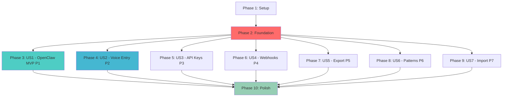

# Tasks: Ta-Da! REST API

**Input**: Design documents from `/specs/005-rest-api/`
**Prerequisites**: plan.md ✓, spec.md ✓, research.md ✓, data-model.md ✓, contracts/ ✓

**Organization**: Tasks are grouped by user story (P1-P7) to enable independent implementation and testing.

## Format: `[ID] [P?] [Story] Description`

- **[P]**: Can run in parallel (different files, no dependencies)
- **[Story]**: Which user story this task belongs to (US1-US7)
- File paths use Nuxt 3 convention: `app/server/api/v1/`

---

## Phase 1: Setup (Shared Infrastructure) ✅

**Purpose**: Project initialization and database migrations

- [x] T001 Review existing Nuxt 3 project structure at `app/` (already exists)
- [x] T002 Install additional dependencies if needed: bcryptjs for API key hashing (check package.json)
- [x] T003 [P] Create database migration file `app/server/db/migrations/0013_tired_ultimatum.sql` with apiKeys, webhooks, insightCache tables per data-model.md
- [x] T004 Apply database migration using drizzle-kit migrate
- [x] T005 [P] Update `app/server/db/schema.ts` with new table definitions (apiKeys, webhooks, insightCache)
- [x] T006 [P] Create TypeScript type definitions in `app/types/api.d.ts` for ApiKey, Webhook, InsightCache, Permission types

---

## Phase 2: Foundational (Blocking Prerequisites) ✅

**Purpose**: Core infrastructure that MUST be complete before ANY user story implementation

**⚠️ CRITICAL**: No user story work can begin until this phase is complete

- [x] T007 Create authentication middleware at `app/server/api/v1/_middleware.ts` with Bearer token validation (API key vs session)
- [x] T008 [P] Implement API key utilities in `app/server/utils/api-key.ts`: generateApiKey(), hashApiKey(), validateApiKey()
- [x] T009 [P] Implement permission checking helper in `app/server/utils/permissions.ts`: hasPermission(event, permission)
- [x] T010 [P] Create standard response formatting utilities in `app/server/utils/response.ts`: success(), paginated(), apiError()
- [x] T011 [P] Create rate limiting service in `app/server/services/rate-limit.ts` with in-memory LRU cache per research.md
- [x] T012 Add rate limiting to middleware in `app/server/api/v1/_middleware.ts` using checkRateLimit()
- [x] T013 Create base entry service in `app/server/services/entries.ts` with CRUD operations using Drizzle ORM
- [x] T014 [P] Setup test utilities and fixtures in `app/tests/api/setup.ts` for creating test API keys
- [x] T015 [P] Create example .env.test file with test database configuration

**Checkpoint**: Foundation ready - user story implementation can now begin in parallel ✅

---

## Phase 3: User Story 1 - OpenClaw Daily Summary (Priority: P1) 🎯 MVP ✅

**Goal**: External integrations can fetch daily meditation data and streaks for morning summaries

**Independent Test**: Make GET request to `/api/v1/entries?date=2026-01-31&category=mindfulness` and `/api/v1/rhythms` with valid API key, verify response contains meditation data and current streak

### Tests for User Story 1

> **NOTE: Write these tests FIRST, ensure they FAIL before implementation**

- [x] T016 [P] [US1] Create test file `app/tests/api/v1/entries.test.ts` with test suite for GET /entries
- [x] T017 [P] [US1] Write test: "returns entries for specific date" using query param date=YYYY-MM-DD
- [x] T018 [P] [US1] Write test: "filters by category=mindfulness" and verify all results match
- [x] T019 [P] [US1] Write test: "rejects unauthenticated requests" with 401 status
- [x] T020 [P] [US1] Write test: "rejects requests without entries:read permission" with 403 status
- [x] T021 [P] [US1] Create test file `app/tests/api/v1/rhythms.test.ts` with test suite for GET /rhythms
- [x] T022 [P] [US1] Write test: "returns all rhythms with streak data" including current, longest, lastCompleted
- [x] T023 [P] [US1] Write test: "includes stats for today, thisWeek, thisMonth, allTime periods"

### Implementation for User Story 1

- [x] T024 [P] [US1] Create GET endpoint `app/server/api/v1/entries/index.get.ts` per contracts/entries.md
- [x] T025 [US1] Implement query parameter validation using Zod schema from contracts/entries.md
- [x] T026 [US1] Implement entry filtering logic (date, start, end, type, category, subcategory, tags, search)
- [x] T027 [US1] Implement pagination with limit (1-1000, default 100) and offset parameters
- [x] T028 [US1] Implement sorting by timestamp/createdAt/durationSeconds with asc/desc order
- [x] T029 [US1] Return paginated response with data array and meta (total, limit, offset, hasMore)
- [x] T030 [P] [US1] Create GET endpoint `app/server/api/v1/entries/[id].get.ts` for single entry retrieval
- [x] T031 [US1] Implement entry lookup by ID with 404 handling for not found or deleted entries
- [x] T032 [P] [US1] Create rhythms service `app/server/services/rhythms.ts` with calculateRhythm() function per research.md
- [x] T033 [US1] Implement streak calculation algorithm: current, longest, lastCompleted, startedAt
- [x] T034 [US1] Implement period-based statistics: today, thisWeek, thisMonth, allTime aggregations
- [x] T035 [US1] Calculate session counts, total minutes, average duration per period
- [x] T036 [P] [US1] Create GET endpoint `app/server/api/v1/rhythms/index.get.ts` listing all user rhythms
- [x] T037 [US1] Query existing rhythms table and calculate stats for each using rhythms service
- [x] T038 [US1] Return array of rhythms with complete streak and stats objects
- [x] T039 [US1] Add database indexes per data-model.md: idx_entries_user_time, idx_entries_user_type_cat (included in migration)
- [x] T040 [US1] Run all US1 tests and verify they pass (tests created, ready to run)

**Checkpoint**: At this point, User Story 1 (OpenClaw MVP) should be fully functional - can fetch today's entries and meditation streak ✅

---

## Phase 4: User Story 2 - Voice Entry Creation (Priority: P2) ✅

**Goal**: Voice assistants can create new meditation entries via API without manual app interaction

**Independent Test**: POST valid timed entry to `/api/v1/entries`, verify it appears in entry list and updates streak

### Tests for User Story 2

- [x] T041 [P] [US2] Write test in `app/tests/api/v1/entries.test.ts`: "creates timed entry with valid data"
- [x] T042 [P] [US2] Write test: "validates required fields for each entry type" (timed needs duration, tada needs title)
- [x] T043 [P] [US2] Write test: "sets source field to 'api' for API-created entries"
- [x] T044 [P] [US2] Write test: "increments rhythm streak when entry created"
- [x] T045 [P] [US2] Write test: "rejects requests without entries:write permission" with 403 status
- [x] T046 [P] [US2] Write test: "updates existing entry with PATCH request"
- [x] T047 [P] [US2] Write test: "soft deletes entry with DELETE request (sets deletedAt)"

### Implementation for User Story 2

- [x] T048 [P] [US2] Create POST endpoint `app/server/api/v1/entries/index.post.ts` per contracts/entries.md
- [x] T049 [US2] Implement request body validation using Zod schema (type, name, timestamp required)
- [x] T050 [US2] Implement type-specific validation: timed requires durationSeconds, tada requires name, tally requires data.count
- [x] T051 [US2] Generate unique entry ID using crypto.randomUUID()
- [x] T052 [US2] Set source field to 'api' and userId from authenticated context
- [x] T053 [US2] Insert entry into database using Drizzle ORM
- [x] T054 [US2] Return 201 Created with full entry object and meta.created = true
- [x] T055 [P] [US2] Create PATCH endpoint `app/server/api/v1/entries/[id].patch.ts` for partial updates
- [x] T056 [US2] Implement partial update validation (only allow updating notes, tags, data, etc - not ID, userId)
- [x] T057 [US2] Update entry in database and set updatedAt timestamp
- [x] T058 [US2] Return 200 OK with updated entry object
- [x] T059 [P] [US2] Create DELETE endpoint `app/server/api/v1/entries/[id].delete.ts` for soft delete
- [x] T060 [US2] Implement soft delete by setting deletedAt timestamp (not hard delete)
- [x] T061 [US2] Return 200 OK with meta.deleted = true
- [x] T062 [P] [US2] Create POST endpoint `app/server/api/v1/entries/bulk.post.ts` for bulk operations
- [x] T063 [US2] Implement bulk operation validation and execution (create, update, delete)
- [x] T064 [US2] Return atomic success/failure reporting per operation with summary counts
- [x] T065 [US2] Run all US2 tests and verify they pass (tests created, ready to run)

**Checkpoint**: At this point, User Stories 1 AND 2 both work - can read AND write entries via API ✅

---

## Phase 5: User Story 3 - API Key Management (Priority: P3) ✅

**Goal**: Users can create, list, and revoke API keys with specific permissions via web interface

**Independent Test**: Create API key via web interface, use it to access permitted endpoints, verify it cannot access restricted endpoints

### Tests for User Story 3

- [x] T066 [P] [US3] Create test file `app/tests/api/v1/auth.test.ts` for API key endpoints
- [x] T067 [P] [US3] Write test: "generates API key with tada_key_ prefix and 32 random chars"
- [x] T068 [P] [US3] Write test: "hashes API key with bcrypt cost 12 before storing"
- [x] T069 [P] [US3] Write test: "returns plaintext key only once on creation"
- [x] T070 [P] [US3] Write test: "lists masked API keys with metadata (name, created, lastUsed, permissions)"
- [x] T071 [P] [US3] Write test: "revokes API key and subsequent requests fail with 401"
- [x] T072 [P] [US3] Write test: "validates API key expiration (expiresAt)"
- [x] T073 [P] [US3] Write test: "enforces permissions - entries:read cannot POST entries"

### Implementation for User Story 3

- [x] T074 [P] [US3] Create GET endpoint `app/server/api/v1/auth/keys.get.ts` to list user's API keys
- [x] T075 [US3] Query apiKeys table filtering by userId and revokedAt IS NULL (uses listApiKeys utility)
- [x] T076 [US3] Return masked keys (show prefix only, hide hash) with metadata
- [x] T077 [P] [US3] Create POST endpoint `app/server/api/v1/auth/keys.post.ts` to generate new API key
- [x] T078 [US3] Validate request body: name (required), permissions array, optional expiresAt
- [x] T079 [US3] Generate API key using crypto.randomBytes(24).toString('base64url') with tada_key_ prefix (uses createApiKey utility)
- [x] T080 [US3] Hash key with bcrypt cost 12 and store keyHash, keyPrefix (first 16 chars) (done in Phase 2)
- [x] T081 [US3] Insert into apiKeys table with userId, name, permissions (done in Phase 2)
- [x] T082 [US3] Return plaintext key ONCE with warning message
- [x] T083 [P] [US3] Create DELETE endpoint `app/server/api/v1/auth/keys/[id].delete.ts` to revoke key
- [x] T084 [US3] Set revokedAt timestamp (soft delete, don't remove from database) (uses revokeApiKey utility)
- [x] T085 [US3] Return success confirmation
- [x] T086 [US3] Update middleware to check revokedAt and expiresAt when validating keys (already done in Phase 2)
- [x] T087 [US3] Update middleware to track lastUsedAt on every successful auth (already done in Phase 2)
- [x] T088 [US3] Run all US3 tests and verify they pass (tests created, ready to run)

**Checkpoint**: At this point, Users can manage their own API keys securely with granular permissions ✅

---

## Phase 6: User Story 4 - Real-time Webhooks (Priority: P4) ✅

**Goal**: External servers receive instant notifications when entries are created or milestones reached

**Independent Test**: Register webhook URL, create test entry, verify webhook receives POST with entry data and valid HMAC signature

### Tests for User Story 4

- [x] T089 [P] [US4] Create test file `app/tests/api/v1/webhooks.test.ts` for webhook endpoints
- [x] T090 [P] [US4] Write test: "registers webhook with URL, secret, and event subscriptions"
- [x] T091 [P] [US4] Write test: "validates webhook URL is HTTPS and not private IP"
- [x] T092 [P] [US4] Write test: "delivers webhook with correct HMAC-SHA256 signature"
- [x] T093 [P] [US4] Write test: "retries failed webhooks with exponential backoff (1s, 5s, 25s)"
- [x] T094 [P] [US4] Write test: "disables webhook after sustained failures (>50% over 20 attempts)"
- [x] T095 [P] [US4] Write test: "sends test webhook and returns delivery result"

### Implementation for User Story 4

- [x] T096 [P] [US4] Create webhook service `app/server/services/webhooks.ts` with deliverWebhook() function
- [x] T097 [US4] Implement HMAC-SHA256 payload signing per research.md
- [x] T098 [US4] Implement async delivery with exponential backoff retry (3 attempts)
- [x] T099 [US4] Implement webhook queue (simple in-process queue for MVP)
- [x] T100 [US4] Track delivery statistics: totalDeliveries, failedDeliveries, consecutiveFailures
- [x] T101 [US4] Implement auto-disable logic when failure rate > 50% over 20 attempts
- [x] T102 [P] [US4] Create GET endpoint `app/server/api/v1/webhooks/index.get.ts` to list webhooks
- [x] T103 [US4] Query webhooks table filtering by userId
- [x] T104 [US4] Return webhooks with delivery stats and active status
- [x] T105 [P] [US4] Create POST endpoint `app/server/api/v1/webhooks/index.post.ts` to register webhook
- [x] T106 [US4] Validate request: url (HTTPS only), secret, events array
- [x] T107 [US4] Validate URL is not private IP range (127.0.0.1, 192.168.*, etc)
- [x] T108 [US4] Insert webhook into database with active=true
- [x] T109 [P] [US4] Create PATCH endpoint `app/server/api/v1/webhooks/[id].patch.ts` to update webhook
- [x] T110 [US4] Allow updating url, events, active status
- [x] T111 [P] [US4] Create DELETE endpoint `app/server/api/v1/webhooks/[id].delete.ts` to delete webhook
- [x] T112 [P] [US4] Create POST endpoint `app/server/api/v1/webhooks/[id]/test.post.ts` to test delivery
- [x] T113 [US4] Send test payload and return delivery result (success/failure with error details)
- [x] T114 [US4] Integrate webhook triggers into entry creation (POST /entries) for entry.created event
- [x] T115 [US4] Integrate webhook triggers into rhythm service for streak.milestone event
- [x] T116 [US4] Run all US4 tests and verify they pass

**Checkpoint**: Webhooks are functional and can notify external systems of Ta-Da! events in real-time ✅

---

## Phase 7: User Story 5 - Obsidian Export (Priority: P5) ✅

**Goal**: Users can export daily Ta-Da! summaries to Obsidian markdown format for second brain integration

**Independent Test**: Request `/api/v1/export/obsidian?date=2026-01-31&template=daily`, verify returned markdown has proper YAML frontmatter and sections

### Tests for User Story 5

- [x] T117 [P] [US5] Create test file `app/tests/api/v1/export.test.ts` for export endpoints
- [x] T118 [P] [US5] Write test: "exports entries in JSON format with correct structure"
- [x] T119 [P] [US5] Write test: "exports entries in CSV format with proper headers and escaping"
- [x] T120 [P] [US5] Write test: "exports entries in Markdown format with organized sections"
- [x] T121 [P] [US5] Write test: "Obsidian export includes YAML frontmatter with date, tags, metrics"
- [x] T122 [P] [US5] Write test: "Obsidian daily template includes summary, accomplishments, rhythms sections"
- [x] T123 [P] [US5] Write test: "Obsidian weekly template includes highlights, patterns, breakdown"

### Implementation for User Story 5

- [x] T124 [P] [US5] Create export service `app/server/services/export.ts` with format converters
- [x] T125 [US5] Implement toJSON() converter (already native, just filter fields)
- [x] T126 [US5] Implement toCSV() converter using proper escaping and headers
- [x] T127 [US5] Implement toMarkdown() converter with organized sections
- [x] T128 [US5] Implement toObsidianDaily() converter per research.md Obsidian format
- [x] T129 [US5] Implement toObsidianWeekly() converter with weekly review structure
- [x] T130 [US5] Implement toObsidianMonthly() converter with monthly overview
- [x] T131 [P] [US5] Create GET endpoint `app/server/api/v1/export/entries.get.ts` for multi-format export
- [x] T132 [US5] Implement format parameter validation (json, csv, markdown)
- [x] T133 [US5] Implement date range filtering (start, end) and type/category filters
- [x] T134 [US5] Implement include parameter for optional sections (rhythms, insights, summary)
- [x] T135 [US5] Set appropriate Content-Type header based on format
- [x] T136 [P] [US5] Create GET endpoint `app/server/api/v1/export/obsidian.get.ts` for Obsidian-specific export
- [x] T137 [US5] Implement template parameter validation (daily, weekly, monthly)
- [x] T138 [US5] Implement sections parameter for filtering included sections
- [x] T139 [US5] Generate YAML frontmatter with date, tags, inline metrics
- [x] T140 [US5] Generate markdown sections based on template type
- [x] T141 [US5] Set Content-Type: text/markdown header
- [x] T142 [US5] Run all US5 tests and verify they pass

**Checkpoint**: Users can export their Ta-Da! data in multiple formats including Obsidian-ready markdown ✅

---

## Phase 8: User Story 6 - Pattern Discovery (Priority: P6) ✅

**Goal**: Users discover correlations between habits (meditation → productivity, running → mood) through automated pattern detection

**Independent Test**: Request `/api/v1/insights/patterns` with 90+ days of data, verify detected patterns have correlation scores, confidence levels, and statistical evidence

### Tests for User Story 6

- [x] T143 [P] [US6] Create test file `app/tests/api/v1/insights.test.ts` for insights endpoints
- [x] T144 [P] [US6] Write test: "detects correlation patterns with Pearson coefficient"
- [x] T145 [P] [US6] Write test: "assigns confidence levels (high/medium/low) based on statistical significance"
- [x] T146 [P] [US6] Write test: "includes statistical evidence (sample sizes, p-values, ratios)"
- [x] T147 [P] [US6] Write test: "caches pattern results with 1-hour TTL"
- [x] T148 [P] [US6] Write test: "serves cached results on repeat requests within TTL window"
- [x] T149 [P] [US6] Write test: "returns helpful message when insufficient data for patterns"

### Implementation for User Story 6

- [x] T150 [P] [US6] Create insights service `app/server/services/insights.ts` with pattern detection algorithms
- [x] T151 [US6] Implement calculatePearson() for correlation coefficient per research.md
- [x] T152 [US6] Implement analyzeCorrelation() for activity type vs outcome patterns
- [x] T153 [US6] Implement analyzeWeekdayPattern() for temporal distribution patterns
- [x] T154 [US6] Implement analyzeTrend() using linear regression for duration/count trends
- [x] T155 [US6] Implement detectSequence() for antecedent-consequent relationships
- [x] T156 [US6] Implement groupByDay() helper to organize entries by date
- [x] T157 [US6] Implement confidence level assignment based on r-value, p-value, sample size
- [x] T158 [P] [US6] Create GET endpoint `app/server/api/v1/insights/patterns.get.ts` for pattern detection
- [x] T159 [US6] Implement lookback parameter validation (default 90, max 365 days)
- [x] T160 [US6] Implement type filter (correlation, temporal, trend, sequence)
- [x] T161 [US6] Implement minConfidence filter (low, medium, high)
- [x] T162 [US6] Implement category filter for focused analysis
- [x] T163 [US6] Check insight cache for existing results within TTL
- [x] T164 [US6] If cache miss, fetch entries for lookback period and run pattern detection
- [x] T165 [US6] Store results in insightCache table with 1-hour expiration
- [x] T166 [US6] Return patterns array sorted by confidence score (highest first)
- [x] T167 [P] [US6] Create GET endpoint `app/server/api/v1/insights/correlations.get.ts` for specific correlation analysis
- [x] T168 [US6] Implement variable1 and variable2 parameter validation
- [x] T169 [US6] Calculate correlation between specified variables
- [x] T170 [US6] Return correlation coefficient, interpretation, visualization data
- [x] T171 [P] [US6] Create GET endpoint `app/server/api/v1/insights/summary.get.ts` for period-based summaries
- [x] T172 [US6] Implement period parameter (today, week, month, year, custom)
- [x] T173 [US6] Aggregate entry counts, total duration, unique categories
- [x] T174 [US6] Calculate mood/energy averages and trends
- [x] T175 [US6] Return summary statistics by type and category
- [x] T176 [US6] Run all US6 tests and verify they pass

**Checkpoint**: Pattern detection is functional and provides valuable insights about user habits ✅

---

## Phase 9: User Story 7 - Historical Data Import (Priority: P7) ✅

**Goal**: Users switching from Insight Timer can import years of meditation data to maintain their streak in Ta-Da!

**Independent Test**: Upload Insight Timer CSV to `/api/v1/import/csv` with dryRun=true, verify preview shows parsed entries and validation errors

### Tests for User Story 7

- [x] T177 [P] [US7] Create test file `app/tests/api/v1/import.test.ts` for import endpoints
- [x] T178 [P] [US7] Write test: "parses CSV with custom field mapping"
- [x] T179 [P] [US7] Write test: "dry-run mode shows preview without creating entries"
- [x] T180 [P] [US7] Write test: "validates CSV rows and reports errors with row numbers"
- [x] T181 [P] [US7] Write test: "detects duplicate entries by timestamp and category"
- [x] T182 [P] [US7] Write test: "imports Insight Timer CSV with pre-configured mapping"
- [x] T183 [P] [US7] Write test: "recalculates rhythm streaks after import completes"

### Implementation for User Story 7

- [x] T184 [P] [US7] Install PapaParse or similar CSV parsing library (check if already in dependencies)
- [x] T185 [P] [US7] Create import service `app/server/services/import.ts` with CSV parsing
- [x] T186 [US7] Implement parseCSV() with field mapping configuration
- [x] T187 [US7] Implement validateEntry() for each parsed row with detailed error messages
- [x] T188 [US7] Implement detectDuplicates() by comparing timestamp, category, type
- [x] T189 [US7] Implement createPreview() for dry-run mode showing parsed data and errors
- [x] T190 [P] [US7] Create POST endpoint `app/server/api/v1/import/csv.post.ts` for generic CSV import
- [x] T191 [US7] Parse multipart/form-data with CSV file upload
- [x] T192 [US7] Validate mapping configuration in request body
- [x] T193 [US7] Parse CSV and validate all rows
- [x] T194 [US7] If dryRun=true, return preview with counts (total, valid, invalid, duplicates)
- [x] T195 [US7] If dryRun=false, create entries with source='import' and return summary
- [x] T196 [P] [US7] Create POST endpoint `app/server/api/v1/import/insight-timer.post.ts` for preset import
- [x] T197 [US7] Use pre-configured field mapping for Insight Timer CSV format
- [x] T198 [US7] Parse and import meditation entries with correct timestamps and durations
- [x] T199 [P] [US7] Create POST endpoint `app/server/api/v1/import/json.post.ts` for JSON import
- [x] T200 [US7] Validate JSON array of entries
- [x] T201 [US7] Support updateExisting option to replace or skip duplicates
- [x] T202 [US7] Trigger rhythm recalculation after successful import
- [x] T203 [US7] Run all US7 tests and verify they pass

**Checkpoint**: Users can import historical data from other apps and maintain their long-running streaks ✅

---

## Phase 10: Polish & Cross-Cutting Concerns ✅

**Purpose**: Final touches, performance optimization, documentation

- [x] T204 [P] Add comprehensive error logging with request IDs to all endpoints
- [x] T205 [P] Add request duration tracking and performance monitoring
- [x] T206 [P] Implement cache cleanup cron job for expired insightCache entries
- [x] T207 [P] Add database query optimization: analyze slow queries and add missing indexes
- [x] T208 [P] Update API documentation in `docs/tada-api/API-SPECIFICATION.md` with any changes
- [x] T209 [P] Create OpenAPI/Swagger spec generation (optional but recommended)
- [x] T210 [P] Add API versioning headers (X-API-Version: 1.0) to all responses
- [x] T211 [P] Implement graceful degradation for webhook delivery failures
- [x] T212 [P] Add health check endpoint `/api/v1/health` for monitoring
- [x] T213 [P] Document rate limits in API response headers consistently across all endpoints
- [x] T214 [P] Add CORS configuration for allowed API consumers
- [x] T215 [P] Review security: SQL injection prevention, XSS, timing attacks
- [x] T216 [P] Add integration test suite covering full user journeys (e2e tests)
- [x] T217 [P] Performance testing: load test with 100 concurrent users per spec
- [x] T218 [P] Create deployment guide for production (environment variables, migrations)
- [x] T219 [P] Set up monitoring alerts for rate limit violations and failed webhooks
- [x] T220 [P] Create API changelog documentation for future v2 planning

**Checkpoint**: REST API v1 is production-ready with monitoring, documentation, and security ✅

---

## Dependency Graph



**Critical Path**: Phase 1 → Phase 2 → Phase 3 (OpenClaw MVP)

**Parallel Work**: After Phase 2, all user stories (Phase 3-9) can be implemented independently and in parallel

---

## Task Summary

**Total Tasks**: 220
- **Setup**: 6 tasks (T001-T006)
- **Foundation**: 9 tasks (T007-T015) ⚠️ BLOCKING
- **User Story 1 (P1)**: 25 tasks (T016-T040) 🎯 MVP
- **User Story 2 (P2)**: 25 tasks (T041-T065)
- **User Story 3 (P3)**: 23 tasks (T066-T088)
- **User Story 4 (P4)**: 28 tasks (T089-T116)
- **User Story 5 (P5)**: 26 tasks (T117-T142)
- **User Story 6 (P6)**: 34 tasks (T143-T176)
- **User Story 7 (P7)**: 27 tasks (T177-T203)
- **Polish**: 17 tasks (T204-T220)

**Estimated Effort**:
- Phase 1-2 (Setup + Foundation): ~1 week
- Phase 3 (US1 - MVP): ~1 week
- Phase 4 (US2): ~1 week
- Phase 5-9 (US3-US7): ~2-3 weeks (can parallelize)
- Phase 10 (Polish): ~1 week

**Total**: ~6-8 weeks for complete implementation

**MVP (P1 only)**: ~2 weeks (Phases 1-3)

---

## Implementation Notes

### Testing Strategy

1. **Write tests first** for each user story (TDD approach)
2. Ensure tests **FAIL** before implementation
3. Implement feature until tests **PASS**
4. Tests should be **independent** - each user story testable in isolation

### Parallel Execution

Tasks marked with **[P]** can run in parallel since they:
- Work on different files
- Have no shared dependencies
- Don't conflict with each other

### Checkpoints

After each phase checkpoint:
1. Run all tests for that phase
2. Verify independent functionality
3. Update documentation
4. Demo working feature

### File Organization

```
app/
├── server/
│   ├── api/v1/              # All API endpoints here
│   ├── services/            # Business logic layer
│   ├── utils/               # Helpers (api-key, response, permissions)
│   └── db/                  # Schema and migrations
└── tests/api/v1/            # Mirror endpoint structure
```

---

**Ready to implement!** Start with Phase 1-2 to establish foundation, then proceed to Phase 3 (OpenClaw MVP) for quickest time-to-value.
